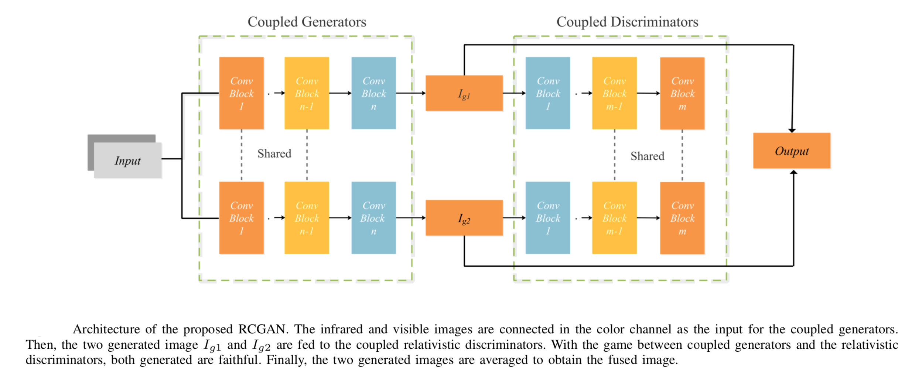
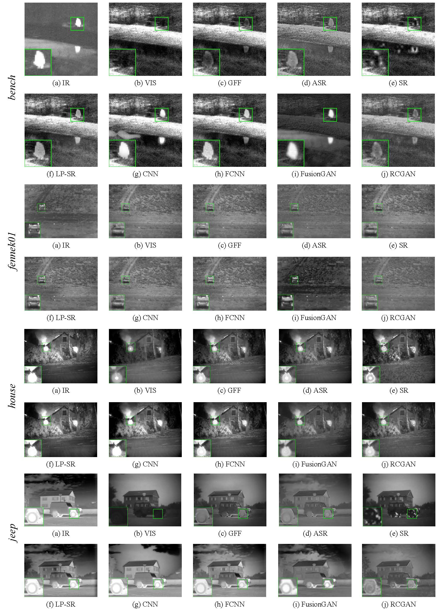
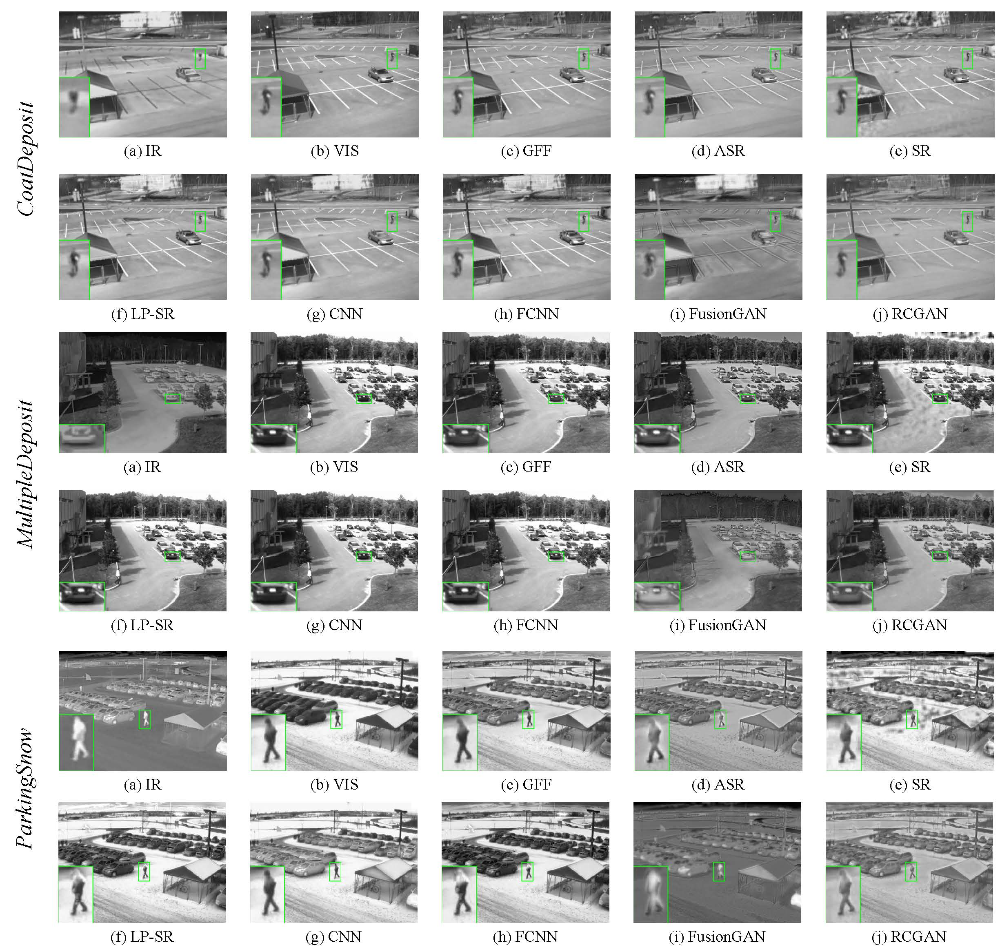

# Coupled GAN with Relativistic Discriminators for Infrared and Visible Images Fusion

This repository is for RCGAN presented in the following paper

[Q. Li](https://liqilei.github.io/), L. Lu, Z. Li, *et al*., "Coupled GAN with Relativistic Discriminators for Infrared and Visible Images Fusion", IEEE SENSORS JOURNAL, 2019. [[Link]](https://doi.org/10.1109/JSEN.2019.2921803) 

This code is tested on Ubuntu 16.04 environment (Python3.6, PyTorch1.1.0, CUDA9.0, cuDNN5.1) with NVIDIA 1080Ti/2080Ti GPU.

## Contents
1. [Introduction](#introduction)
2. [Test](#test)
4. [Train](#train)
5. [Results](#results)
6. [Citation](#citation)
7. [Acknowledgements](#acknowledgements)

## Introduction

Infrared and visible images are a pair of multi- source multi-sensors images. However, infrared image lack structural details and visible images are impressionable to the imaging environment. To fully utilize the meaningful information of infrared and visible images, a practical fusion method, termed as RCGAN, is proposed in this paper. In RCGAN, we introduce a pioneering use of the coupled generative adversarial network to the field of image fusion. Moreover, the simple yet efficient relativistic discriminator is applied to our network. By doing so, the network converges faster. More importantly, different from the previous works in which the label for generator is either infrared image or visible image, we innovatively put forward a strategy to use a pre-fused image as the label. This is a technical innovation, which makes the process of generating fused images no longer out of thin air, but from ‘existence’ to ‘excellent’. Extensive experiments demonstrate the effectiveness of our network compared with other state-of-the-art methods.



## Test
1. The pre-trained model is placed in  `release` folder.
     Modify`options/test/test_RCGAN.json` to specify your own test options. Pay particular attention to the follow options:
`dataroot_VI`:  the path of visible dataset for test.
`dataroot_IR`:  the path of infrared dataset for test.
     
2. Cd to the root folder and run the follow command:
     `python test.py -opt options/test/test_RCGAN.json`

     Then, bomb, you can get the Fused images in the `./release/results` folder. Besides the `./release/cmp` folder contains the the source images and fused images for a better comparison. 

## Train
### Prepare training data 

1. Pre-fuse the infrared and visible images using GFF in `./preparation/1. GFF`. Then, the pre-fused images will appear in `./Demo_dataset/train/ori_img/pf`.
3. Modify and run `preparation/2. generate_train_data.py` to crop the training data into patches. The default setting of the patches size is `120 * 120` and the stride is 14. After executing, a folder named `./Demo_dataset/train/sub_img` can be obtained. 

### Specify the train options 

Modify`options/train/train_RCGAN.json` to specify your own train options. Pay particular attention to the follow options:

`dataroot_VI` the path of  visible dataset for train or validation
`dataroot_IR`:  the path of infrared dataset for train or validation
`dataroot_PF`:  the path of pre-fused dataset for train or validation

More settings such as `n_workers`(threads), `batch_size` and other hy-parameters are set to default. You may modify them for your own sack. 

<u>Tips:</u>

1. `resume` option allows you to continue training your model even after the interruption. By setting set `resume = true`, the program will read the last saved check-point located in `resume_path`. 
2. We set `'data_type':'npy_reset'` to speed up data reading during training. Since reading a numpy file is faster than reading an image file, we first transform PNG file to numpy file. This process is only performed once when the first time data is accessed.

5. After performing above modifications, you can start training process by running `python train.py -opt options/train/train_RCGAN.json`. Then, you can get you model in `experiment/*****/epoch/checkpoint.pth`. You can also visualize the train loss and validation loss in `results/results.csv`. 

## Results

### Visual Results




### Quantitative Results


For more results, please refer to our [main papar](https://doi.org/10.1109/JSEN.2019.2921803)

## Citation

If you find the code helpful in your research or work, please cite our paper:

```
Q. Li et al., "Coupled GAN with Relativistic Discriminators for Infrared and Visible Images Fusion," in IEEE Sensors Journal.
```

## Acknowledgements

This code is built on [BasicSR](https://github.com/xinntao/BasicSR). We thank the authors for sharing their codes. 
